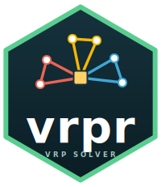
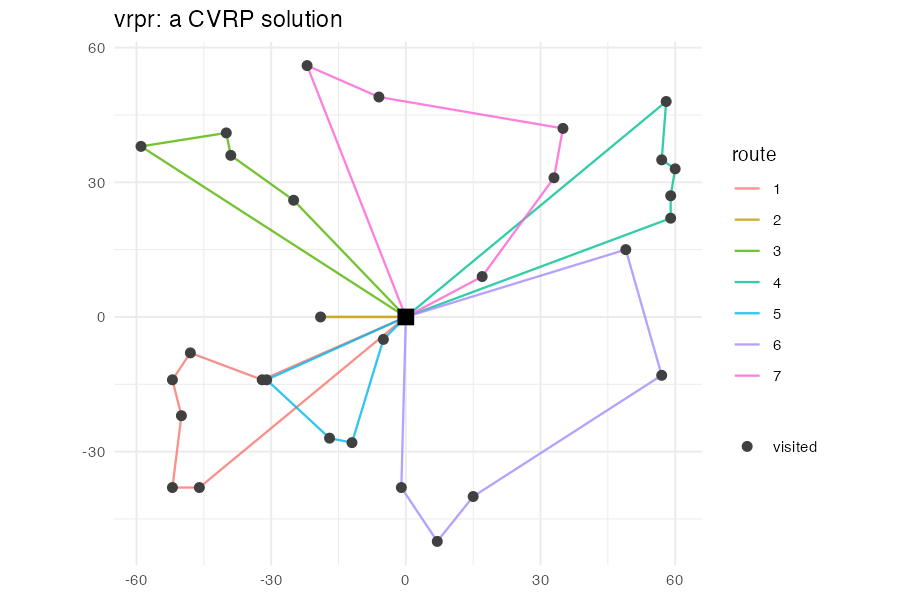

# vrpr 

<!-- badges: start -->
[](https://github.com/StrategicProjects/vrpr/actions/workflows/R-CMD-check.yaml)
[](https://strategicprojects.github.io/vrpr/)
[](https://lifecycle.r-lib.org/articles/stages.html#experimental)
[](https://opensource.org/licenses/MIT)
[](https://en.wikipedia.org/wiki/C%2B%2B20)
[](https://github.com/PyVRP/PyVRP)
<!-- badges: end -->

> A production-grade vehicle routing problem (VRP) solver for R.

**vrpr** brings the state-of-the-art [PyVRP](https://github.com/PyVRP/PyVRP) solver to R. It vendors
PyVRP's high-performance C++ core and rewires it with [cpp11](https://cpp11.r-lib.org), wrapped in an
idiomatic, **tidyverse-style** API: a pipe-friendly model builder, data in tibbles, and logging via
[cli](https://cli.r-lib.org) — with **no Python runtime dependency**.

It fills a real gap in the R ecosystem: there are `ompr`, `ROI`, `lpSolve`, `igraph` and `dodgr`,
but no modern, strong, friendly solver for production vehicle routing.

<p align="center"></p>

## Highlights

- **All the classic VRP variants**, from one tidy interface: capacitated VRP, time windows (VRPTW),
  heterogeneous fleets, multiple depots (MDVRP), prize-collecting with optional clients and mutually
  exclusive groups, simultaneous pickup & delivery / backhaul, and multi-trip routes.
- **Fast** — the search runs entirely in PyVRP's C++ core (iterated local search with late-acceptance
  hill-climbing). No Python required.
- **Verified parity with PyVRP** — identical objective, and on the X-n101-k25 benchmark (optimum
  27591) both reach the optimum in 10 s (see `tools/benchmark/`).
- **Reads standard instances** (VRPLIB / TSPLIB and Solomon) and **plots** solutions with ggplot2.

## Installation

```r
# install.packages("pak")
pak::pak("StrategicProjects/vrpr")
```

A C++20 toolchain is required to build from source (R >= 4.3).

## Quick start

```r
library(vrpr)

clients <- tibble::tibble(
  x = c(10, 25, 40, 15), y = c(5, 30, 12, 22),
  demand = c(10, 15, 8, 12)
)

res <- vrp_model() |>
  add_depot(x = 0, y = 0) |>
  add_clients(clients) |>
  add_vehicle_type(num_available = 3, capacity = 50) |>
  vrp_solve(stop = max_runtime(2))

cost(res)      # objective cost
routes(res)    # tibble: route_id, depot, position, client, vehicle_type, ...
summary(res)   # one-row summary
plot(res)      # the routes, with {ggplot2}
```

## Variants

| Variant | How |
|---|---|
| Time windows (VRPTW) | add `tw_early`, `tw_late`, `service` to clients |
| Heterogeneous fleet | call `add_vehicle_type()` several times with different capacities/costs |
| Multiple depots (MDVRP) | several `add_depot()` + `add_vehicle_type(depot = i)` |
| Prize-collecting | `required = FALSE` + `prize` on clients; `add_client_group()` for exclusive sets |
| Pickup & delivery / backhaul | add a `pickup` column to clients |
| Multi-trip | `add_vehicle_type(reload_depots = i, max_reloads = k)` |

See the [Getting started](https://strategicprojects.github.io/vrpr/articles/vrpr.html) guide and the
[Articles](https://strategicprojects.github.io/vrpr/articles/) for worked examples of each.

## Reading standard instances

```r
m <- read_vrplib(system.file("extdata", "sample-n6-k2.vrp", package = "vrpr"))
m <- read_solomon(system.file("extdata", "sample-solomon.txt", package = "vrpr"))
res <- m |> vrp_solve(stop = max_runtime(5))
```

## How it works

<p align="center"></p>

`vrpr` is a thin, idiomatic R skin over PyVRP's C++ engine:

1. **Tidy R API** — you build a model from tibbles and call `vrp_solve()`.
2. **R orchestration** — the iterated local search loop, penalty manager and stopping criteria, a
   faithful port of PyVRP's `IteratedLocalSearch`.
3. **cpp11 binding** — long-lived C++ objects travel as external pointers; data crosses as tibbles
   and matrices, with integer-measure validation at the boundary.
4. **Vendored PyVRP C++ core** (`src/vendor/pyvrp/`, version pinned in `tools/PYVRP_VERSION`) — the
   hot compute: problem data, cost evaluation, solutions and the local-search operators.

The light R loop drives the heavy C++ search, so you get PyVRP-grade performance with a pure-R,
Python-free workflow.

## License

MIT. Derived from PyVRP (© PyVRP contributors, Thibaut Vidal, ORTEC), whose copyright is preserved;
see [`inst/COPYRIGHTS`](inst/COPYRIGHTS).
