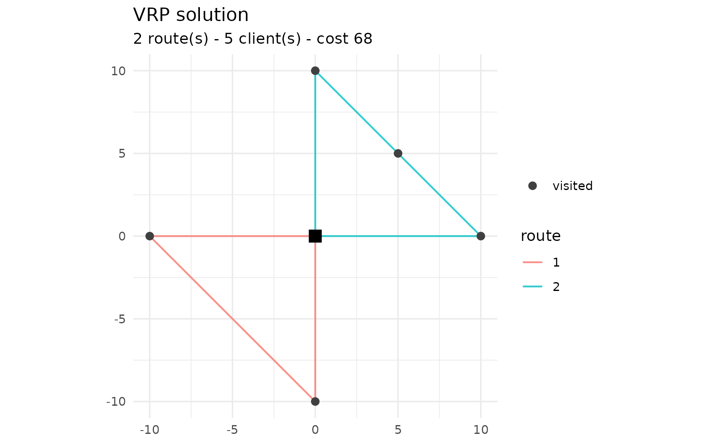

# Reading instances and parity with PyVRP

``` r

library(vrpr)
```

## Standard instance formats

`vrpr` ships native readers for the two most common benchmark formats,
with no Python dependency. Both return a `vrpr_model` you can solve
right away.

### VRPLIB / TSPLIB

[`read_vrplib()`](https://strategicprojects.github.io/vrpr/reference/read_vrplib.md)
reads CVRP (and VRPTW) instances in the VRPLIB/CVRPLIB format – for
example the well-known X set of Uchoa et al. It supports Euclidean
coordinates (`EDGE_WEIGHT_TYPE : EUC_2D`) and reads time-window and
service-time sections when present.

``` r

path <- system.file("extdata", "sample-n6-k2.vrp", package = "vrpr")

model <- read_vrplib(path)
#> ✔ Read "sample-n6-k2": 5 clients, 1 depot, capacity 30, 2 vehicles.
model
#> 
#> ── VRP model ───────────────────────────────────────────────────────────────────
#> • 1 depot
#> • 5 clients
#> • 1 vehicle type

res <- vrp_solve(model, stop = max_iterations(300), seed = 1, display = FALSE)
plot(res)
```



The number of vehicles is taken from the `VEHICLES`/`TRUCKS` field, or
from the `-k<n>` suffix in the instance name, or — as a last resort —
the number of clients. You can always override it with `num_vehicles =`.

### Solomon

[`read_solomon()`](https://strategicprojects.github.io/vrpr/reference/read_solomon.md)
reads VRPTW instances in the Solomon (and Gehring-Homberger) format: a
`VEHICLE` section with the fleet size and capacity, and a `CUSTOMER`
table with coordinates, demand, time window and service time. Customer 0
is the depot.

``` r

path <- system.file("extdata", "sample-solomon.txt", package = "vrpr")
read_solomon(path) |>
  vrp_solve(stop = max_iterations(300), seed = 1, display = FALSE) |>
  cost()
#> ✔ Read "SAMPLE": 4 clients, capacity 50, 3 vehicles (VRPTW).
#> [1] 62
```

## Distances

When you do not supply explicit matrices, `vrpr` computes the Euclidean
distance between coordinates and rounds it half up (`floor(d + 0.5)`) —
the TSPLIB `EUC_2D` convention, which is what the published best-known
solutions assume. You can pass your own `distance` and `duration`
matrices to
[`vrp_problem_data()`](https://strategicprojects.github.io/vrpr/reference/vrp_problem_data.md)
(and hence to
[`vrp_solve()`](https://strategicprojects.github.io/vrpr/reference/vrp_solve.md))
for road networks or asymmetric travel times.

## Parity with PyVRP

Because `vrpr` vendors PyVRP’s C++ core, it is faithful to the reference
solver on two levels.

**Objective parity (exact).** The same solution scores identically on
both sides, since they share the same C++ `CostEvaluator`. On the
bundled `sample-n6-k2` instance, the routes `[[1, 2], [3, 4, 5]]` cost
81 in both `vrpr` and PyVRP.

**Quality parity.** On the `X-n101-k25` instance (100 clients, known
optimum **27591**), a 10-second release build of `vrpr` reaches the
optimum, matching PyVRP, with a comparable number of iterations. The
reproducible benchmark lives in `tools/benchmark/` (`parity.R` drives
`vrpr`, `pyvrp_side.py` the reference).

| Solver | cost  | gap to optimum |
|--------|-------|----------------|
| PyVRP  | 27591 | 0.00 %         |
| vrpr   | 27591 | 0.00 %         |

> When benchmarking, always measure a **release** build
> (`R CMD INSTALL`), not the debug build of `devtools::load_all()`: the
> debug build compiles without optimisation and with the core’s
> assertions enabled, making it many times slower and distorting any
> throughput comparison.

## The algorithm

`vrpr` runs the same iterated local search as PyVRP: an initial descent,
then repeated rounds of perturbation and local search, with Late
Acceptance Hill-Climbing (Burke & Bykov, 2017) as the acceptance
criterion, a restart from the best after a stretch without improvement,
and an exhaustive refinement of each new best. Penalty weights for load,
time-window and distance violations are adapted online. Tune any of this
through \[ils_params()\].
