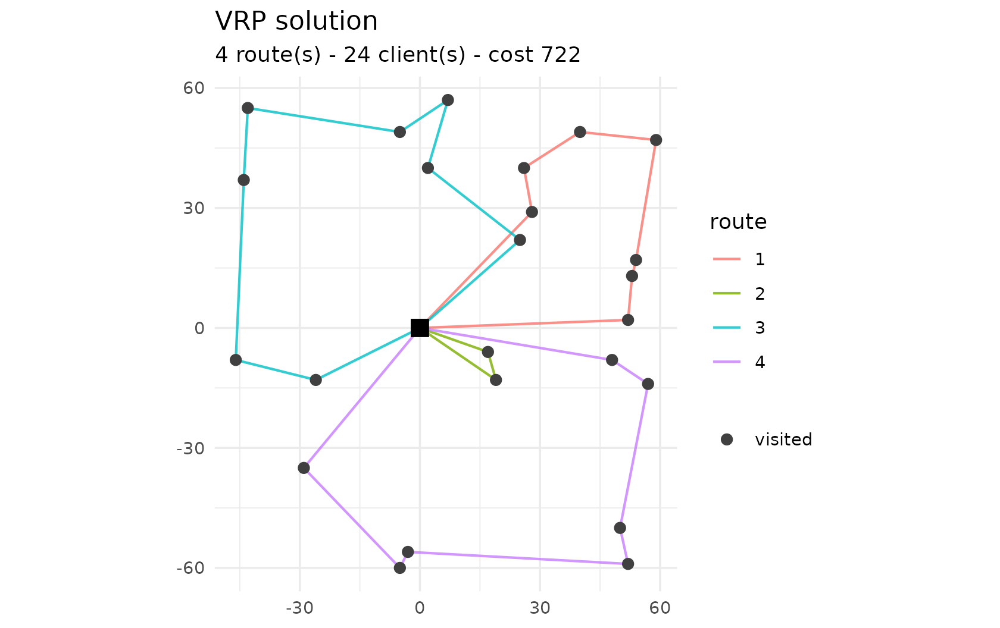
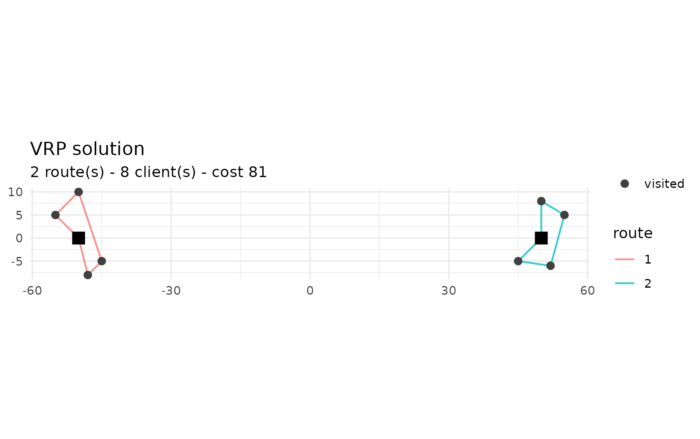
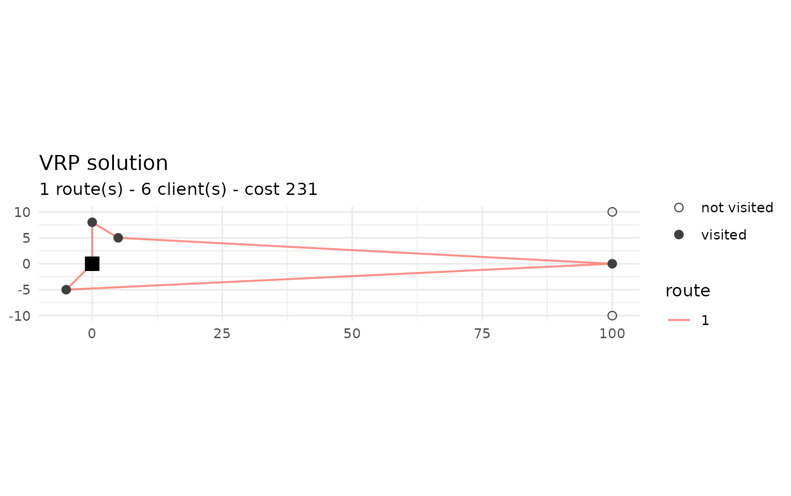

# Problem variants

``` r

library(vrpr)
```

`vrpr` exposes every variant of the classic vehicle routing problem
through the same tidy interface: you describe depots, clients and
vehicle types, and the solver figures out the rest. This article walks
through each one.

Throughout, we stop the solver after a fixed number of iterations to
keep the article reproducible; in practice you would usually pass a time
budget such as `max_runtime(10)`.

## Capacitated VRP (CVRP)

The base case: clients have a `demand`, vehicles a `capacity`, and we
minimise total travel distance.

``` r

set.seed(42)
clients <- tibble::tibble(
  x = round(runif(24, -60, 60)),
  y = round(runif(24, -60, 60)),
  demand = sample(5:18, 24, replace = TRUE)
)

cvrp <- vrp_model() |>
  add_depot(0, 0) |>
  add_clients(clients) |>
  add_vehicle_type(num_available = 6, capacity = 70)

res <- vrp_solve(cvrp, stop = max_iterations(800), seed = 1, display = FALSE)
res
#> 
#> ── vrpr result ─────────────────────────────────────────────────────────────────
#> • cost 722 - feasible
#> • 4 routes - 24 clients
#> • 800 iterations - 0.38s
plot(res)
```



## Time windows (VRPTW)

Add `tw_early`, `tw_late` and `service` columns to make each client
serviceable only within a window. The solver respects the windows, and
[`routes()`](https://strategicprojects.github.io/vrpr/reference/routes.md)
reports the `start_service` and `wait` time of every visit.

``` r

tw_clients <- tibble::tibble(
  x        = c(10, 20, 30, 40, 50, 60),
  y        = 0,
  demand   = 10,
  tw_early = c(0, 30, 60, 90, 120, 150),
  tw_late  = c(50, 80, 110, 140, 170, 200),
  service  = 10
)

vrptw <- vrp_model() |>
  add_depot(0, 0, tw_early = 0, tw_late = 500) |>
  add_clients(tw_clients) |>
  add_vehicle_type(num_available = 2, capacity = 60, tw_early = 0, tw_late = 500)

res_tw <- vrp_solve(vrptw, stop = max_iterations(500), seed = 1, display = FALSE)
routes(res_tw)[, c("route_id", "client", "start_service", "wait")]
#> # A tibble: 6 × 4
#>   route_id client start_service  wait
#>      <int>  <int>         <dbl> <dbl>
#> 1        1      1            50     0
#> 2        1      2            70     0
#> 3        1      3            90     0
#> 4        1      4           110     0
#> 5        1      5           130     0
#> 6        1      6           150     0
```

Notice that the solver may *delay departure* so that no time is wasted
waiting: here every visit starts exactly within its window with zero
waiting.

## Heterogeneous fleet

Call
[`add_vehicle_type()`](https://strategicprojects.github.io/vrpr/reference/add_vehicle_type.md)
more than once for a fleet of different vehicles – different capacities,
fixed costs, distance costs or shifts. Below, an expensive type costs
ten times more per unit distance than a cheap one of the same capacity;
the solver only uses the cheap type.

``` r

het <- vrp_model() |>
  add_depot(0, 0) |>
  add_clients(clients) |>
  add_vehicle_type(num_available = 4, capacity = 70, unit_distance_cost = 1) |>
  add_vehicle_type(num_available = 4, capacity = 70, unit_distance_cost = 10)

res_het <- vrp_solve(het, stop = max_iterations(800), seed = 1, display = FALSE)
table(`vehicle type` = routes(res_het)$vehicle_type)
#> vehicle type
#>  1 
#> 24
```

## Multiple depots (MDVRP)

Add several depots and base each vehicle type at one of them with
`add_vehicle_type(depot = i)`. The
[`routes()`](https://strategicprojects.github.io/vrpr/reference/routes.md)
output gains a `depot` column, and the solver assigns each client to the
nearest depot’s vehicles.

``` r

mdvrp <- vrp_model() |>
  add_depot(x = -50, y = 0) |>
  add_depot(x =  50, y = 0) |>
  add_clients(tibble::tibble(
    x = c(-55, -45, -50, -48, 55, 45, 50, 52),
    y = c(5, -5, 10, -8, 5, -5, 8, -6),
    demand = 10
  )) |>
  add_vehicle_type(num_available = 3, capacity = 50, depot = 1) |>
  add_vehicle_type(num_available = 3, capacity = 50, depot = 2)

res_md <- vrp_solve(mdvrp, stop = max_iterations(500), seed = 1, display = FALSE)
plot(res_md)
```



## Prize-collecting

Mark clients as optional with `required = FALSE` and give them a
`prize`. The solver visits an optional client only when its prize
offsets the routing cost;
[`unvisited_clients()`](https://strategicprojects.github.io/vrpr/reference/unvisited_clients.md)
lists those left out (drawn as hollow circles by
[`plot()`](https://rdrr.io/r/graphics/plot.default.html)).

``` r

pc <- vrp_model() |>
  add_depot(0, 0) |>
  add_clients(tibble::tibble(
    x = c(5, -5, 0, 100, 100, 100),
    y = c(5, -5, 8, 10, 0, -10),
    demand = 10,
    required = c(TRUE, TRUE, TRUE, FALSE, FALSE, FALSE),
    prize = c(0, 0, 0, 5, 500, 5)
  )) |>
  add_vehicle_type(num_available = 4, capacity = 50)

res_pc <- vrp_solve(pc, stop = max_iterations(500), seed = 1, display = FALSE)
unvisited_clients(res_pc)
#> [1] 4 6
plot(res_pc)
```



[`add_client_group()`](https://strategicprojects.github.io/vrpr/reference/add_client_group.md)
goes further: it defines a set of mutually exclusive alternatives, of
which at most one (or exactly one, if `required = TRUE`) is visited.

## Pickup & delivery / backhaul

Give clients a `pickup` amount in addition to their `demand` (delivery).
The collected load accumulates along the route and counts toward the
vehicle’s capacity, modelling simultaneous pickup and delivery (and
backhaul).

``` r

pd <- vrp_model() |>
  add_depot(0, 0) |>
  add_clients(tibble::tibble(
    x = c(20, 40, -20, -40), y = 0,
    demand = 20, pickup = 30
  )) |>
  add_vehicle_type(num_available = 3, capacity = 60)

res_pd <- vrp_solve(pd, stop = max_iterations(300), seed = 1, display = FALSE)
res_pd$is_feasible
#> [1] TRUE
```

## Multi-trip

Allow a vehicle to return to a depot mid-route to reload, with
`add_vehicle_type(reload_depots = i, max_reloads = k)`. A single vehicle
can then serve far more than its capacity in one shift;
`summary()$num_trips` counts the trips.

``` r

mt <- vrp_model() |>
  add_depot(0, 0) |>
  add_clients(tibble::tibble(x = c(10, -10, 0, 5), y = c(0, 0, 10, -10), demand = 30)) |>
  add_vehicle_type(num_available = 1, capacity = 50, reload_depots = 1, max_reloads = 10)

res_mt <- vrp_solve(mt, stop = max_iterations(500), seed = 1, display = FALSE)
summary(res_mt)[, c("cost", "num_routes", "num_trips")]
#> # A tibble: 1 × 3
#>    cost num_routes num_trips
#>   <dbl>      <int>     <int>
#> 1    82          1         4
```

A single vehicle (capacity 50) serves four clients of demand 30 – 120 in
total – by making several trips back to the depot.
