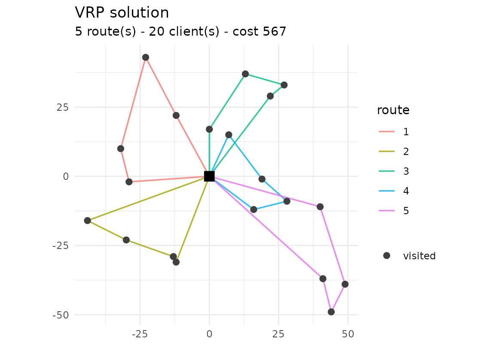

# Getting started with vrpr

`vrpr` is a tidyverse-style interface to the
[PyVRP](https://github.com/PyVRP/PyVRP) vehicle-routing solver. You
build a model by piping together depots, clients and vehicle types, then
call
[`vrp_solve()`](https://strategicprojects.github.io/vrpr/reference/vrp_solve.md).
The heavy lifting runs in PyVRP’s C++ core (rewired with cpp11), so
there is **no Python dependency**.

``` r

library(vrpr)
```

## A first CVRP

The capacitated VRP (CVRP) is the base case: clients have a `demand`,
vehicles a `capacity`, and we minimise total distance. The data boundary
is a tibble.

``` r

set.seed(1)
clients <- tibble::tibble(
  x = round(runif(20, -50, 50)),
  y = round(runif(20, -50, 50)),
  demand = sample(5:15, 20, replace = TRUE)
)

model <- vrp_model() |>
  add_depot(x = 0, y = 0) |>
  add_clients(clients) |>
  add_vehicle_type(num_available = 5, capacity = 50)

res <- vrp_solve(model, stop = max_iterations(500), seed = 1, display = FALSE)
res
#> 
#> ── vrpr result ─────────────────────────────────────────────────────────────────
#> • cost 567 - feasible
#> • 5 routes - 20 clients
#> • 500 iterations - 0.2s
```

Inspect the result with
[`cost()`](https://strategicprojects.github.io/vrpr/reference/cost.md),
[`routes()`](https://strategicprojects.github.io/vrpr/reference/routes.md)
(a tidy long table) and
[`summary()`](https://rdrr.io/r/base/summary.html):

``` r

cost(res)
#> [1] 567
head(routes(res))
#> # A tibble: 6 × 7
#>   route_id depot position client vehicle_type start_service  wait
#>      <int> <int>    <int>  <int>        <int>         <dbl> <dbl>
#> 1        1     1        1     11            1            29     0
#> 2        1     1        2     12            1            41     0
#> 3        1     1        3      1            1            75     0
#> 4        1     1        4     19            1            99     0
#> 5        2     1        1     14            1            33     0
#> 6        2     1        2      2            1            35     0
summary(res)
#> # A tibble: 1 × 8
#>    cost is_feasible num_routes num_trips num_clients distance iterations runtime
#>   <dbl> <lgl>            <int>     <int>       <int>    <dbl>      <int>   <dbl>
#> 1   567 TRUE                 5         5          20      567        500   0.199
```

If [ggplot2](https://ggplot2.tidyverse.org) is installed,
[`plot()`](https://rdrr.io/r/graphics/plot.default.html) draws the
routes:

``` r

plot(res)
```



## Stopping criteria

[`vrp_solve()`](https://strategicprojects.github.io/vrpr/reference/vrp_solve.md)
runs until a stopping criterion fires. Combine time- and iteration-based
limits as needed:

``` r

vrp_solve(model, stop = max_runtime(seconds = 10)) # wall-clock budget
vrp_solve(model, stop = max_iterations(5000))      # iteration budget
vrp_solve(model, stop = no_improvement(1000))      # stop when stuck
```

## Time windows (VRPTW)

Add `tw_early`, `tw_late` and `service` columns to the clients to turn
the model into a VRP with time windows. The solver respects the windows,
and
[`routes()`](https://strategicprojects.github.io/vrpr/reference/routes.md)
reports the `start_service` and `wait` time of each visit.

``` r

tw_clients <- tibble::tibble(
  x        = c(10, 20, 30, 40, 50, 60),
  y        = 0,
  demand   = 10,
  tw_early = c(0, 30, 60, 90, 120, 150),
  tw_late  = c(50, 80, 110, 140, 170, 200),
  service  = 10
)

vrptw <- vrp_model() |>
  add_depot(0, 0, tw_early = 0, tw_late = 500) |>
  add_clients(tw_clients) |>
  add_vehicle_type(num_available = 2, capacity = 60, tw_early = 0, tw_late = 500)

res_tw <- vrp_solve(vrptw, stop = max_iterations(500), seed = 1, display = FALSE)
routes(res_tw)[, c("route_id", "client", "start_service", "wait")]
#> # A tibble: 6 × 4
#>   route_id client start_service  wait
#>      <int>  <int>         <dbl> <dbl>
#> 1        1      1            50     0
#> 2        1      2            70     0
#> 3        1      3            90     0
#> 4        1      4           110     0
#> 5        1      5           130     0
#> 6        1      6           150     0
```

## Heterogeneous fleet

Call
[`add_vehicle_type()`](https://strategicprojects.github.io/vrpr/reference/add_vehicle_type.md)
several times for a fleet of different vehicles. Here a cheap type and
an expensive one share the same capacity; the solver prefers the cheaper
type and only uses what it needs.

``` r

het <- vrp_model() |>
  add_depot(0, 0) |>
  add_clients(clients) |>
  add_vehicle_type(num_available = 3, capacity = 50, unit_distance_cost = 1) |>
  add_vehicle_type(num_available = 3, capacity = 50, unit_distance_cost = 5)

res_het <- vrp_solve(het, stop = max_iterations(500), seed = 1, display = FALSE)
table(routes(res_het)$vehicle_type)
#> 
#>  1  2 
#> 13  7
```

## Multiple depots (MDVRP)

Add several depots and base each vehicle type at one of them with
`add_vehicle_type(depot = i)`. The
[`routes()`](https://strategicprojects.github.io/vrpr/reference/routes.md)
output gains a `depot` column.

``` r

mdvrp <- vrp_model() |>
  add_depot(x = -50, y = 0) |>
  add_depot(x =  50, y = 0) |>
  add_clients(tibble::tibble(
    x = c(-55, -45, -50, 55, 45, 50),
    y = c(5, -5, 10, 5, -5, 8),
    demand = 10
  )) |>
  add_vehicle_type(num_available = 3, capacity = 50, depot = 1) |>
  add_vehicle_type(num_available = 3, capacity = 50, depot = 2)

res_md <- vrp_solve(mdvrp, stop = max_iterations(500), seed = 1, display = FALSE)
routes(res_md)[, c("route_id", "depot", "client")]
#> # A tibble: 6 × 3
#>   route_id depot client
#>      <int> <int>  <int>
#> 1        1     1      1
#> 2        1     1      3
#> 3        1     1      2
#> 4        2     2      4
#> 5        2     2      6
#> 6        2     2      5
```

## Prize-collecting

Mark clients as optional with `required = FALSE` and give them a
`prize`. The solver visits an optional client only when the prize
offsets the routing cost;
[`unvisited_clients()`](https://strategicprojects.github.io/vrpr/reference/unvisited_clients.md)
lists those left out.
[`add_client_group()`](https://strategicprojects.github.io/vrpr/reference/add_client_group.md)
defines mutually exclusive alternatives.

``` r

pc <- vrp_model() |>
  add_depot(0, 0) |>
  add_clients(tibble::tibble(
    x = c(5, -5, 0, 100, 100),
    y = c(5, -5, 8, 10, -10),
    demand = 10,
    required = c(TRUE, TRUE, TRUE, FALSE, FALSE),
    prize = c(0, 0, 0, 5, 500)
  )) |>
  add_vehicle_type(num_available = 4, capacity = 50)

res_pc <- vrp_solve(pc, stop = max_iterations(500), seed = 1, display = FALSE)
unvisited_clients(res_pc)
#> [1] 4
```

## Reading standard instances

[`read_vrplib()`](https://strategicprojects.github.io/vrpr/reference/read_vrplib.md)
and
[`read_solomon()`](https://strategicprojects.github.io/vrpr/reference/read_solomon.md)
read CVRP/VRPTW instances in the standard VRPLIB/TSPLIB and Solomon
formats, returning a `vrpr_model` ready to solve.

``` r

path <- system.file("extdata", "sample-n6-k2.vrp", package = "vrpr")
read_vrplib(path) |>
  vrp_solve(stop = max_iterations(200), seed = 1, display = FALSE) |>
  cost()
#> ✔ Read "sample-n6-k2": 5 clients, 1 depot, capacity 30, 2 vehicles.
#> [1] 68
```

## Other variants

The same data boundary supports more variants:

- **Pickup & delivery / backhaul** – add a `pickup` column to clients;
  the collected load counts toward capacity along the route.
- **Multi-trip** –
  `add_vehicle_type(reload_depots = i, max_reloads = k)` lets a vehicle
  return to a depot to reload and run several trips.

See
[`?add_vehicle_type`](https://strategicprojects.github.io/vrpr/reference/add_vehicle_type.md)
and
[`?add_clients`](https://strategicprojects.github.io/vrpr/reference/add_clients.md)
for the full set of options.
